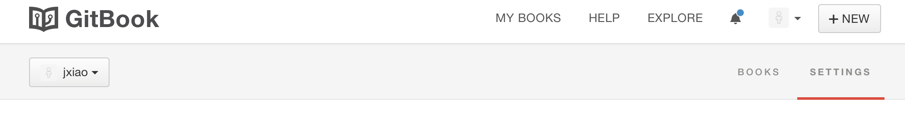
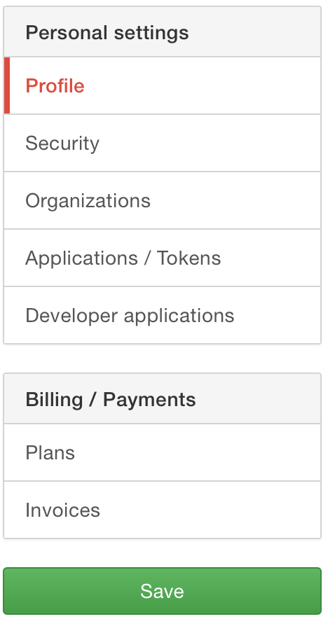
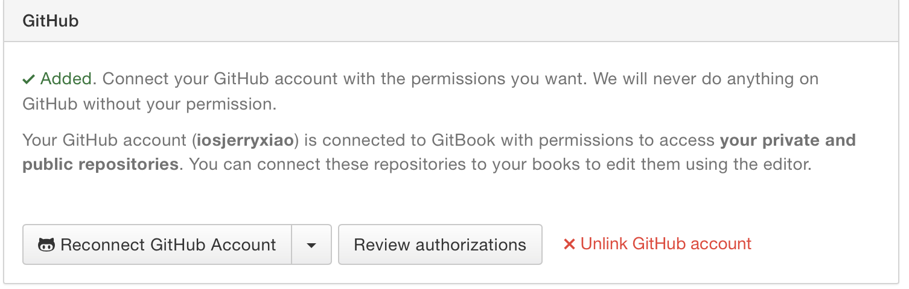
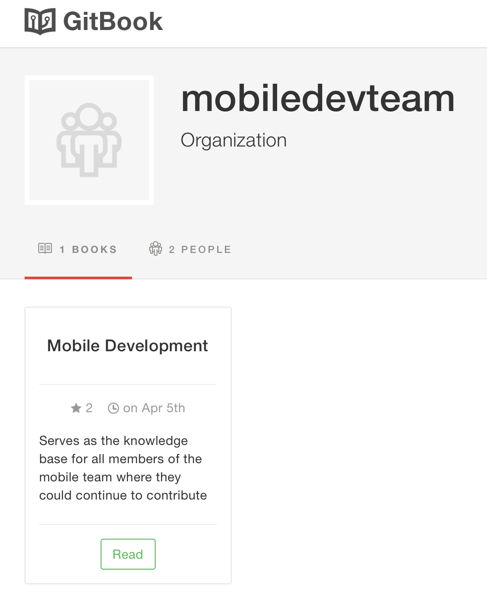
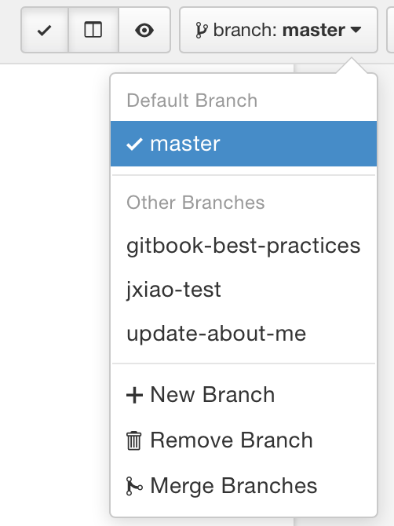
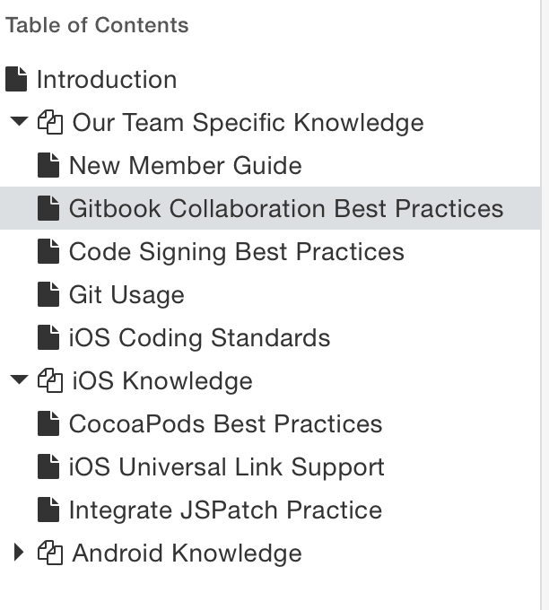

# Gitbook Collaboration Best Practices

## Why Gitbook

We want to find something different from the traditional team blogging systems.
It should allow the co-authors to easily collaborate. 
It should allow checking history versions of each article.
It should allow an article to be reviewed by the co-authors before published.
Most importantly, it should be fun.
Then we found Gitbook.
Look at the equations below to have a general idea about Gitbook:
* Github = git + code + pull request
* Gitbook = git + article

Since Gitbook integrates seamlessly with Github, so:
* Gitbook (advanced) = git + article + pull request

## Prerequisites

Make sure you have both Github and Gitbook accounts. Please email your accounts to Jerry who will add the accounts as:
* a member of the Gitbook team(mobiledevteam)
* a collaborator of the Gitbook book
* a collaborator of the Gitbook source repo in Github

Make sure you connet your Gitbook with your Github account:
* Tap the SETTINGS tab.

* Select Profile in the sidebar.

* Scroll down to connect your account with your Github account.

##Start creating your first article for the team!

1. Under the organization mobiledevteam, you can see the cover of this book "Mobile Development". That's the book waiting for your contribution!

2. Tap into the book and find the Edit button.

3. Tap into the book editing page. **Make sure the first thing you do before editing is to branch off from master and make any modification in your own branch**. You can find the branch switching area here:

4. Create your own articles under some chapter or create new chapters if necessary.

5. Make sure to save your changes when complete. Each save operation will fire a commit and push in git. You will find your newly-created branch in the [Github repo](https://github.com/iosjerryxiao/mobile-development).
6. Finally, make pull request for your branch in Github and wait for collaborators' response.
7. Done!

